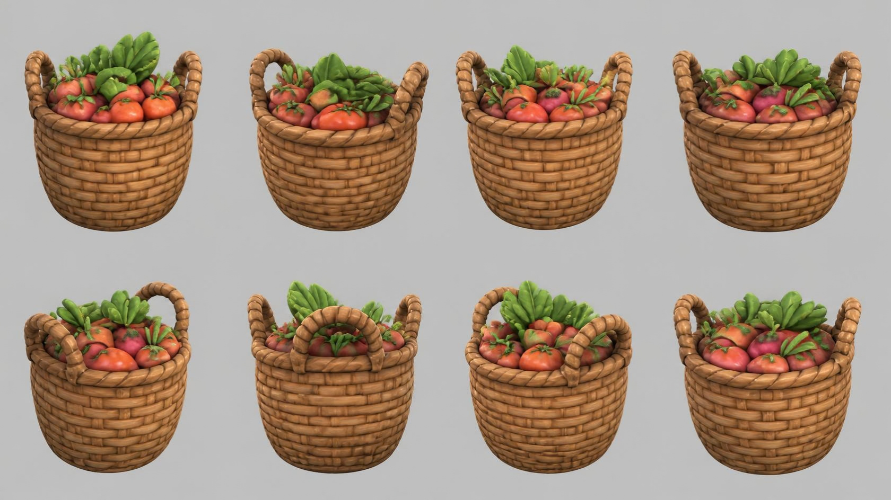

# basket — wicker basket with vegetables

**Reference images (look at these first; the text below only supports them):**

Written by Claude from the Canva sheet `canva/06_basket_360.png` (primary reference) and the
source image. Sizes marked *estimate* are Claude's; the proportions are measured on the sheet.

## What it is
A round woven wicker basket with two looped handles, piled high with red vegetables and leafy
greens. Chunky, soft stylised game-art weave.

## Shape
- **Basket body**: height 0.4 m *(estimate; anchor for scale)*; round; widest just below the
  rim (diameter ≈ 1.05 × height), tapering to a narrower rounded base (≈ 0.75 × the widest
  diameter). Slight belly.
- **Weave**: horizontal rows of flat woven reeds, each row made of short overlapping segments
  in a brick-like staggered pattern, about 10–11 rows from base to rim, each row bulging
  slightly.
- **Rim**: a thick twisted rope-like roll around the top edge.
- **Handles**: two thick twisted/braided loops, one on each side (left and right in the
  front view), rising above the rim by ≈ 30 % of the body height; arch-shaped.
- **Contents** (heaped above the rim, dome-shaped, ≈ 25 % of body height above it):
  red-orange tomatoes (#d9553a), pink-red radishes/beets (#c9486a) with small green tops,
  and a bunch of large green leaves (#6aa63e, lighter veins) standing up at the back.

## Colours and materials (kit)
Weave, rim and handles → `wicker` (ambientCG via the add-on), tinted warm tan-brown (#a8703c),
modelled with real row/segment geometry so the weave reads in silhouette; vegetables →
`flat` colours (slightly glossy for tomatoes); leaves → `flat` green, double-sided thin shapes.

## Budget
Medium piece: ≤ 20 000 triangles.
