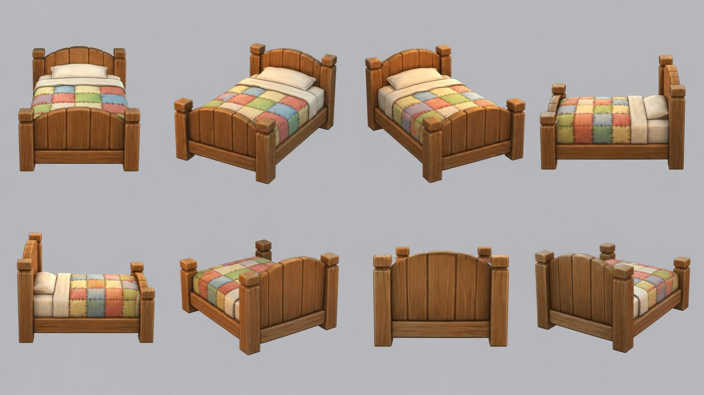

# bed — wooden bed with patchwork quilt

**Reference images (look at these first; the text below only supports them):**

Written by Claude from the Canva sheet `canva/02_bed_360.png` (primary reference) and the
source image `source.jpg`. Sizes marked *estimate* are Claude's; the
proportions are measured on the sheet.

## What it is
A sturdy single bed in chunky rustic wood with a plank headboard and footboard, a cream
mattress and sheet, one pillow and a colourful stitched patchwork quilt. Stylised hand-crafted
game-art look: thick rounded timbers, soft bevels, soft fabric.

## Frame (proportions from the sheet)
- **Head posts** height 1.2 m *(estimate; anchor for scale)*. Four square posts, thick
  (≈ 9 % of the bed width), each topped by a square cap block a little wider than the post,
  with bevelled top edges.
- **Foot posts** ≈ 70 % of the head-post height.
- **Width** (outside of the posts) ≈ 1.05 × head-post height; **length** (side view 90°)
  ≈ 1.2 × the width. Follow the sheet's proportions.
- **Headboard**: 5 vertical planks between the head posts, with visible gaps/grooves, the top
  edge a gentle convex arch rising toward the middle; a thick horizontal rail below the planks.
- **Footboard**: same construction as the headboard, lower, also with an arched top edge.
- **Side rails**: thick horizontal beams joining head and foot posts on both sides, at about
  25 % of the head-post height, carrying the mattress.
- Wood: warm medium brown (#9a5f33), visible grain, darker in the plank gaps; slightly worn
  rounded edges.

## Bedding
- **Mattress/sheet**: cream (#efe3c8), soft rounded edges, top at ≈ 45 % of the head-post
  height, sitting between the rails.
- **Pillow**: off-white (#f2e8d2), puffy, rounded, against the headboard.
- **Sheet fold**: at the head end the quilt is folded back, showing a cream band of sheet.
- **Quilt**: covers most of the mattress and drapes a little over the sides; a grid of
  patches about 4–5 across and 5–6 along, colours mixed: coral red (#dd8070), sage green
  (#9bbd6c), butter yellow (#efd37f), sky blue (#8db2d4), peach (#f0b98a), cream (#f3e6c4);
  darker dashed stitch lines along the patch seams.

## Materials (kit)
frame → `wood_timber` (or `wood_planks` for the board planks) tinted brown; sheet, pillow →
`linen` tinted cream; quilt patches → `linen` with a tint per patch colour (or `flat`),
stitches → small dark geometry or `flat`.

## Budget
Large piece: ≤ 40 000 triangles.
