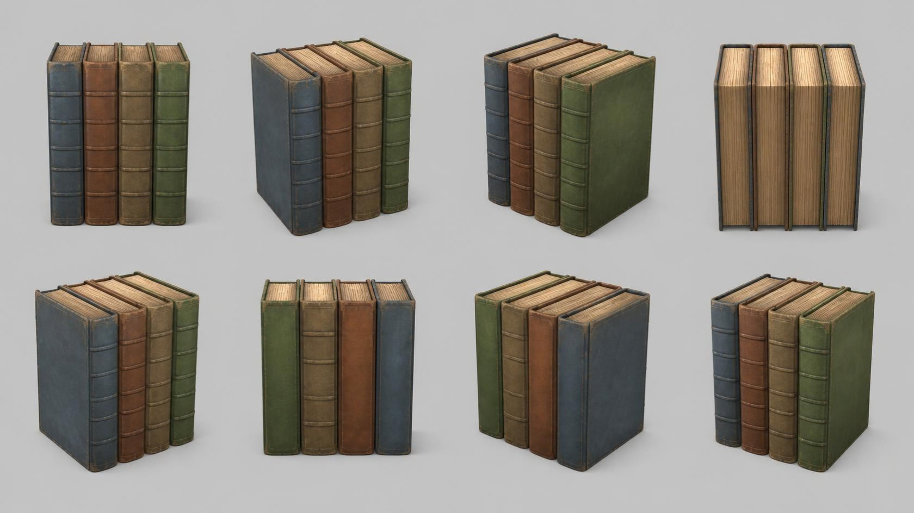

# books — row of four old leather books

**Reference images (look at these first; the text below only supports them):**

Written by Claude from the Canva sheet `canva/13_books_360.png` (primary reference) and the
source image. Sizes marked *estimate* are Claude's; the proportions are measured on the sheet.

## What it is
Four hardcover books standing upright side by side, spines facing front. Old leather
bindings, worn edges, no lettering.

## Shape (front view, 0°: the spines)
- **Book height** 0.25 m *(estimate; anchor for scale)*; each book ≈ 0.72 × height deep
  (front to back) and ≈ 0.2 × height thick; small gaps between the books.
- **Spines** (left to right): slate blue (#56708a), rust brown (#9a5a36), olive tan
  (#9a8a58), moss green (#5e7d3c). Each spine is slightly rounded and has 5–6 raised
  horizontal bands (ribs), plus faint stitched edge lines.
- **Covers**: the side covers are the same colour as the spine, slightly larger than the page
  block (they overhang the pages by a few mm on top, bottom and fore-edge); corners worn
  and lighter.
- **Pages**: cream/tan page block (#d8c49a) with fine horizontal page lines, visible on the
  top and at the fore-edge (the back side, sheet view 90°/270°).

## Materials (kit)
Covers and spines → `leather` tinted per book; pages → `wood_fine` or `linen` tinted cream
(or `flat`) with modelled ribs/grooves on the spines.

## Budget
Small piece: ≤ 10 000 triangles.
