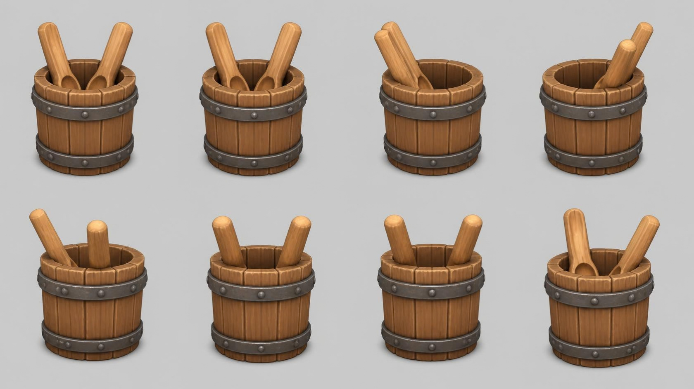

# bucket — wooden bucket with two wooden spoons

**Reference images (look at these first; the text below only supports them):**

Written by Claude from the Canva sheet `canva/07_bucket_360.png` (primary reference) and the
source image. Sizes marked *estimate* are Claude's; the proportions are measured on the sheet.

## What it is
A small round wooden bucket (tub) of vertical staves bound by two riveted iron hoops, holding
two long wooden spoons that lean outward over the rim. Chunky stylised game-art look.

## Shape
- **Bucket**: height 0.35 m *(estimate; anchor for scale)*; round; diameter at the top
  ≈ 1.05 × height, very slightly narrower at the base (almost straight sides).
- **Staves**: about 14–16 vertical staves around the circumference, each a slightly bevelled
  plank with a visible groove between staves; the stave tops form a thick rim with small
  gaps; the inside shows the staves' inner faces and a wooden floor.
- **Hoops**: two dark iron bands (#4a4744), one ≈ 20 % below the rim, one ≈ 15 % above the
  base, each ≈ 12 % of the height tall, standing slightly proud of the staves, with round
  rivet heads spaced evenly around them (about 12 per hoop).
- **Spoons**: two long wooden spoons (handle length ≈ 1.2 × bucket height) with round
  handles and shallow oval bowls, standing inside the bucket bowl-down, leaning outward
  at ≈ 20–30° from vertical toward opposite sides, handles rising well above the rim.

## Colours and materials (kit)
Staves → `wood_planks` or `wood_timber` tinted warm brown (#9a5f33); spoons → `wood_fine`
tinted lighter honey (#c98a4a); hoops and rivets → `iron` tinted dark grey.

## Budget
Medium piece: ≤ 20 000 triangles.
