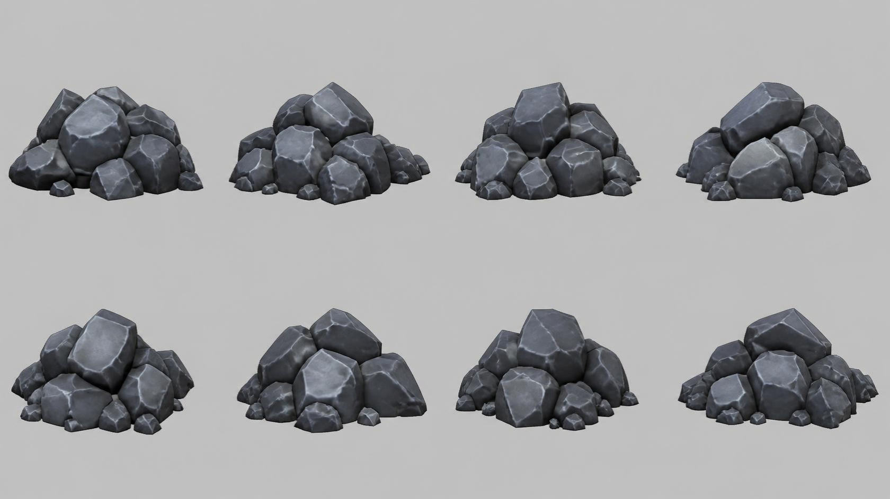

# coal — pile of coal and stone lumps

**Reference images (look at these first; the text below only supports them):**

Written by Claude from the Canva sheet `canva/09_coal_360.png` (primary reference) and the
source image. Sizes marked *estimate* are Claude's; the proportions are measured on the sheet.

## What it is
A loose heap of dark, faceted coal/stone lumps. Stylised: chunky polygonal lumps with softly
bevelled facets and pale highlight lines along the facet edges.

## Shape
- **Pile footprint** 0.6 m across *(estimate; anchor for scale)*; roughly round; height
  ≈ 0.55 × footprint; mound-shaped.
- **Lumps**: about 12–16 large faceted lumps (each ≈ 20–35 % of the pile width) stacked into a
  mound, with one or two big lumps on top, plus 8–12 small pebbles scattered around the base.
- **Lump shape**: irregular convex polyhedra (like cut gems or broken rock) with 6–10 visible
  facets, facet edges slightly rounded.
- **Colour**: dark slate blue-grey (#4a4f5a) with lighter grey (#8a929e) edge highlights and
  faint lighter veins; low-gloss (slight sheen).

## Materials (kit)
`rock_dark` tinted dark slate blue-grey; lumps from randomised convex hulls or bevelled
low-subdivision shapes (seeded, deterministic).

## Budget
Medium piece: ≤ 20 000 triangles.
