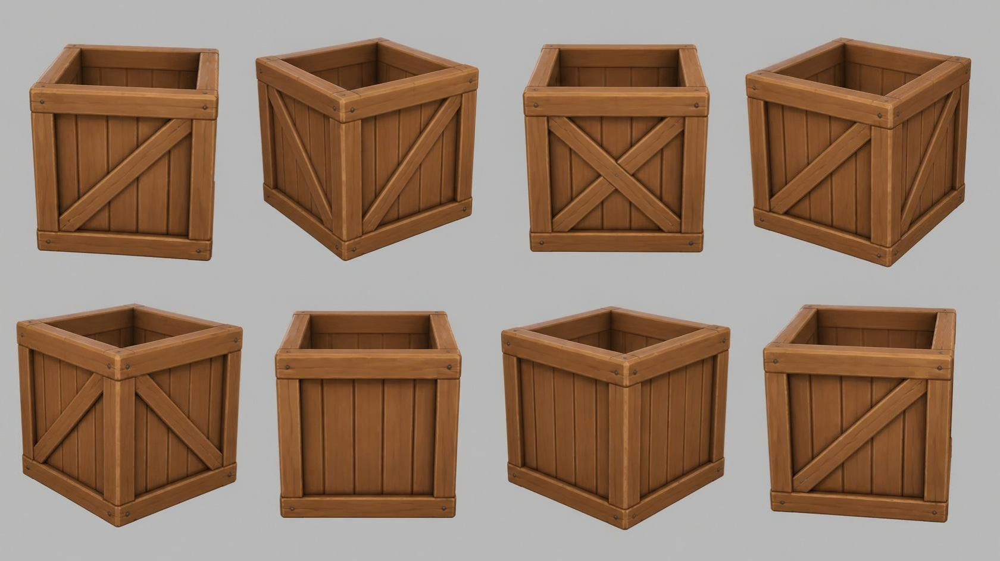

# crate — open wooden crate with braces

**Reference images (look at these first; the text below only supports them):**

Written by Claude from the Canva sheet `canva/05_crate_360.png` (primary reference) and the
source image. Sizes marked *estimate* are Claude's; the proportions are measured on the sheet.

## What it is
An open-topped square wooden storage crate: vertical plank walls held by a thick frame, with
diagonal braces on some faces. Chunky stylised game-art wood with small nail heads.

## Shape
- **Size** 0.6 m wide *(estimate; anchor for scale)*; square footprint; height ≈ 0.95 × width.
- **Frame**: thick square battens along all 12 edges: four vertical corner posts, a top rim
  frame and a bottom frame. The frame sticks out a little from the plank faces. Top rim
  battens are mitred/overlapped at the corners.
- **Panels**: each face is filled with 5–6 vertical planks with visible grooves between them.
- **Braces** (applied battens on top of the planks, between the frame members):
  - one face has a full **X** (two crossing diagonals);
  - two faces have a **single diagonal** (running bottom-left to top-right as seen from
    outside); the sheet shows it on the faces at 0° and 180° views;
  - the fourth face has **no brace** (plain planks, sheet view at 225°).
- **Nails**: small round dark iron nail heads at the ends of the frame battens (two per end).
- **Inside**: open top; inner walls are plain planks; a plank floor inside.

## Colours and materials (kit)
Warm medium brown wood (#9b6236), frame battens a touch lighter and more worn on the edges
than the planks → `wood_planks` for the panels, `wood_timber` for frame and braces, both
tinted; nails → `iron` tinted dark (or `flat`).

## Budget
Medium piece: ≤ 20 000 triangles.
