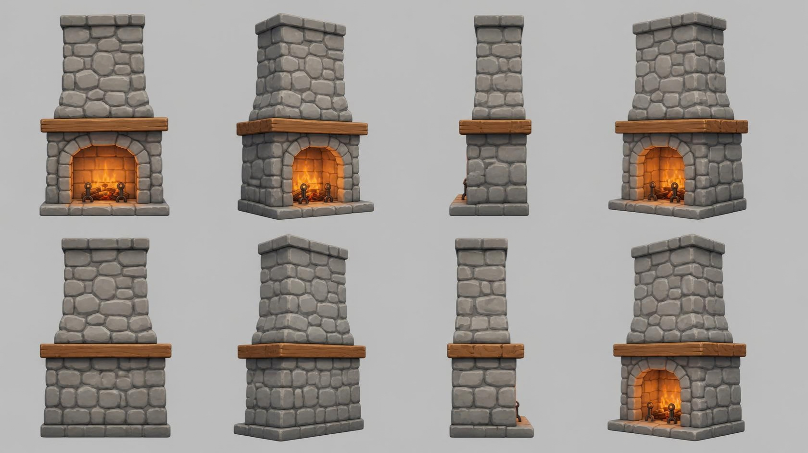

# fireplace — stone fireplace with chimney

**Reference images (look at these first; the text below only supports them):**

Written by Claude from the Canva sheet `canva/01_fireplace_360.png` (primary reference) and the
source image `source.jpg`. Sizes marked *estimate* are Claude's; the
proportions are measured on the sheet.

## What it is
A free-standing rustic stone fireplace: a wide firebox block with an arched opening, a thick
wooden mantel beam on top of it, and a narrower stone chimney stack rising above the mantel.
Stylised, hand-crafted game-art look: chunky rounded stones, soft bevels, warm glowing fire.

## Shape and proportions (front view, 0°)
- **Overall height** 2.8 m *(estimate; anchor for scale)*. On the sheet: total ≈ 420 px.
- **Hearth slab** at the bottom: a low stone platform, ≈ 5 % of the height, wider than the
  body by a small margin each side and reaching clearly further forward than the body
  (the side views show it sticking out in front with an andiron standing on it).
- **Firebox body** from the hearth to the mantel: ≈ 43 % of the total height; width ≈ 0.58 of
  the total height (≈ 1.6 m); depth ≈ 0.55 × its width (side view 90°).
- **Arched opening** centred in the body: round-topped arch; opening ≈ 55 % of the body width
  and ≈ 75 % of the body height. The arch is framed by a ring of wedge-shaped voussoir stones,
  slightly lighter and more regular than the wall stones.
- **Mantel beam**: one thick wooden plank lying across the top of the body, overhanging the
  body ≈ 5 % each side and a little at the front; thickness ≈ 6 % of total height. Warm
  mid-brown wood with visible grain and slightly worn, rounded edges.
- **Chimney stack** above the mantel: ≈ 50 % of the total height; ≈ 70 % of the body width at
  its base, narrowing slightly toward the top, with slanted "shoulders" where it meets the
  mantel. Depth ≈ 75 % of the body depth.
- **Chimney cap**: a slightly wider band of flat stones on the top.
- **Back and sides**: plain stone wall, no opening.

## Stones
Irregular, rounded rectangular stones of varied size (bigger low down), laid in rough courses,
each bulging slightly, separated by recessed darker mortar joints. Colour: cool mid-grey
(#9a9a9a), individual stones varying from #8a8a8a to #b0b0b0; mortar #5f5f5f. Matte.

## Firebox interior
- Back and inner walls: small orange-red bricks (#c9683a), lit warmly by the fire.
- A few split logs lying across the floor of the firebox (bark brown, pale cut ends).
- Fire: tongues of flame rising from the logs, yellow at the core (#ffd35a) to orange
  (#ff8a2a); emissive (glowing).
- Two dark iron andirons (#3a302b) standing at the front of the firebox: upright posts with
  curled scroll tops and small feet.

## Materials (kit)
stone → `stone` tinted grey; mortar → `stone` tinted darker, or `flat`; brick → `brick` tinted
orange; mantel → `wood_timber` tinted warm brown; logs → `bark` and `wood_fine`; andirons →
`iron` tinted dark; flames → `flat(..., emission=...)`.

## Budget
Large piece: ≤ 40 000 triangles.
