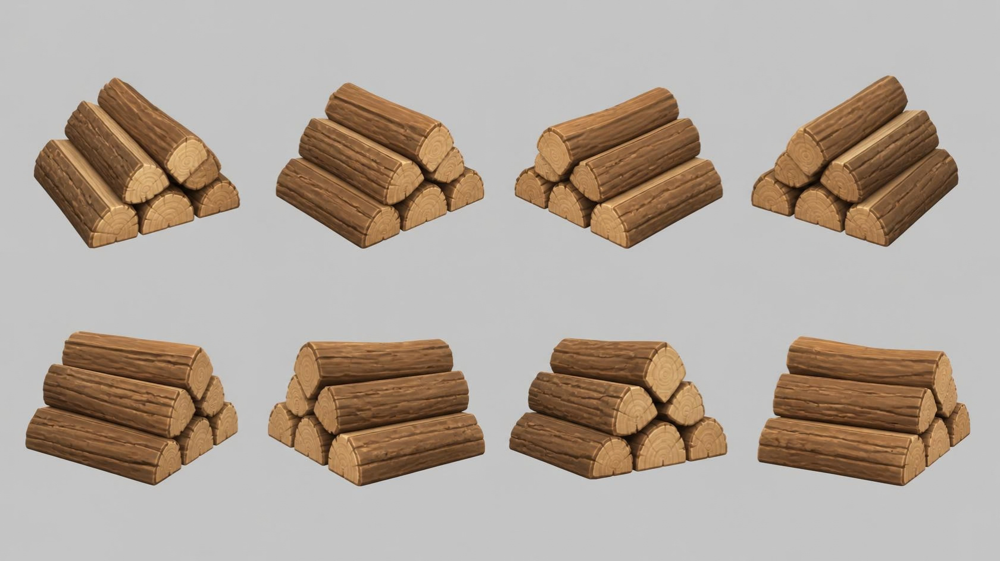

# firewood — stack of split firewood logs

**Reference images (look at these first; the text below only supports them):**

Written by Claude from the Canva sheet `canva/08_firewood_360.png` (primary reference) and the
source image. Sizes marked *estimate* are Claude's; the proportions are measured on the sheet.

## What it is
A small, neat pyramid stack of chunky firewood logs. Stylised game-art wood: thick bark with
carved grooves, pale cut ends with growth rings.

## Shape
- **Log length** 0.6 m *(estimate; anchor for scale)*; log diameter ≈ 0.25 × length; all
  logs about the same length, ends roughly aligned (a few stick out a little).
- **Stack**: 6 logs in three layers, 3 on the bottom, 2 in the middle, 1 on top, all lying
  parallel, each upper log resting in the groove between two below. Stack width
  (across the logs) ≈ 3 log diameters; height ≈ 2.7 log diameters.
- **Logs**: some whole round logs, some split halves/quarters (flat split faces showing pale
  wood); cross-sections slightly irregular, not perfect circles.
- **Bark**: brown (#8a5a35), with deep lengthwise grooves and cracks, rounded chunky edges.
- **Cut ends**: pale tan wood (#e3bf8a) with concentric darker growth rings (#c79a62) and a
  thin bark rim; slightly bevelled edges.

## Materials (kit)
Bark → `bark` tinted brown; cut ends → `wood_fine` tinted pale tan, or `flat` with modelled
ring grooves. Use geometry (bevels, `kit.roughen` with small strength) for the carved bark.

## Budget
Medium piece: ≤ 20 000 triangles.
