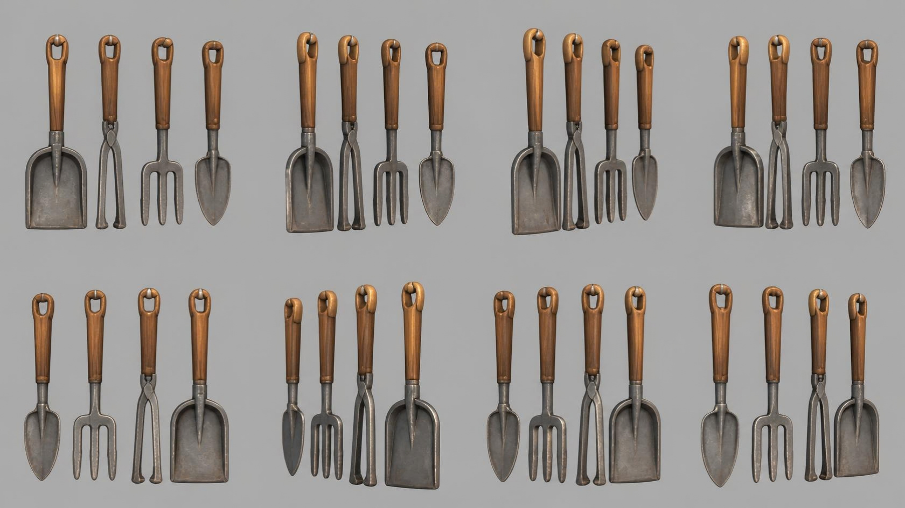

# hanging_tools — four hand tools hanging in a row

**Reference images (look at these first; the text below only supports them):**

Written by Claude from the Canva sheet `canva/15_hanging_tools_360.png` (primary reference) and
the source image. Sizes marked *estimate* are Claude's; the proportions are measured on the
sheet. Wall-mounted: build with `origin="back"`.

**Note on the sheet:** the views are not an even turn of one arrangement: the order of the
tools changes between rows. Use the top-left view as the front (left to right: fire shovel,
tongs, fork, trowel) and read each tool's own shape from all eight views.

## What it is
Four old hand tools with turned wooden handles, hanging side by side from pegs, blades down,
evenly spaced. One wall prop.

## Tools (front view, left to right; lengths relative to the shovel)
- **Fire shovel** 0.55 m long *(estimate; anchor for scale)*: flat, nearly square scoop with
  raised side edges and a central ridge, on a narrow iron shank.
- **Tongs** ≈ 0.95: two long iron arms hinged under the handle, meeting at the bottom tips.
- **Garden fork** ≈ 0.9: three straight tines on a short cross-bar and shank.
- **Trowel** ≈ 0.9: pointed, spade-shaped blade with a central ridge.
- **Handles** (all tools): turned wood, round, slightly thicker near the top, ≈ 45 % of the
  tool length, with a flattened top end pierced by a rounded slot (hanging hole); a thin iron
  ferrule where the handle meets the shank.
- **Pegs**: a small iron peg through each hanging hole (optionally a short wall rail); the
  tools hang flat against the wall.

## Colours and materials (kit)
Handles → `wood_fine` tinted warm honey-brown (#9c6636); iron parts → `iron` tinted mid grey
(#7c7c78) with darker edges, slightly worn.

## Budget
Medium piece: ≤ 20 000 triangles.
