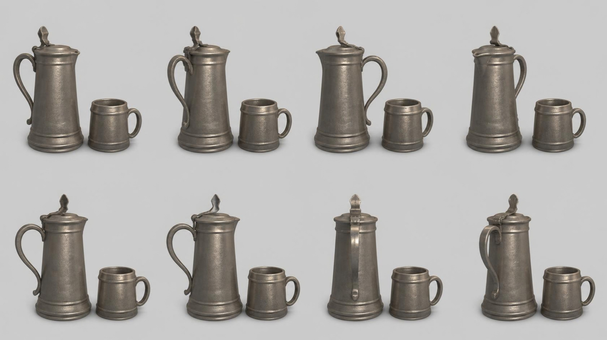

# pitcher_mug — pewter lidded pitcher and mug

**Reference images (look at these first; the text below only supports them):**

Written by Claude from the Canva sheet `canva/14_pitcher_mug_360.png` (primary reference) and
the source image. Sizes marked *estimate* are Claude's; the proportions are measured on the
sheet.

**Note on the sheet:** Canva rotated the pitcher in each view but kept the mug to its right
in every view. Build one prop with the mug standing to the right of the pitcher (as in the
top-left view, the front); read the pitcher's handle, lid and spout from all eight views.

## What it is
A tall pewter tankard-pitcher with a hinged lid and a matching pewter mug, standing side by
side. Soft grey metal with a dull sheen.

## Pitcher
- **Height** 0.32 m to the lid top *(estimate; anchor for scale)*, plus the thumb-piece
  finial ≈ 12 % more.
- **Body**: tapering cylinder, wider at the base (base diameter ≈ 0.5 × height, top
  ≈ 0.38 × height), with a stepped foot ring (two raised bands near the base) and a thin band
  near the top.
- **Lid**: flat, slightly domed disc with a small lip spout at the front; a hinge at the back
  with an upright, pointed leaf-shaped thumb-piece.
- **Handle**: S-curved strap handle on the back, from under the hinge down to about 20 %
  above the base, ending in a small curled tip.

## Mug
- **Height** ≈ 0.45 × the pitcher height; slightly barrel-shaped cylinder (diameter
  ≈ 0.9 × its height), a raised band near the top and a foot band at the base, open top
  showing the inside, a C-shaped loop handle.

## Colours and materials (kit)
Both in pewter: warm mid-grey metal (#8a857a), darker in the recesses, brighter on edges,
low-gloss metallic → `pewter` tinted (metallic, roughness ≈ 0.45). Build bodies with
`kit.lathe`.

## Budget
Small piece: ≤ 10 000 triangles.
