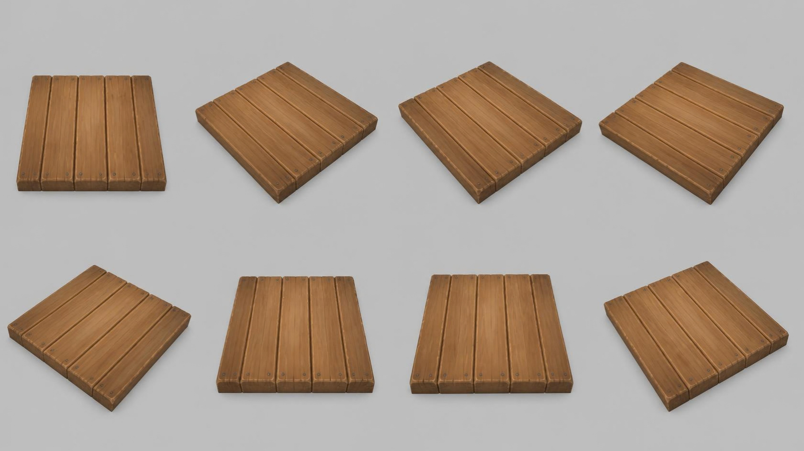
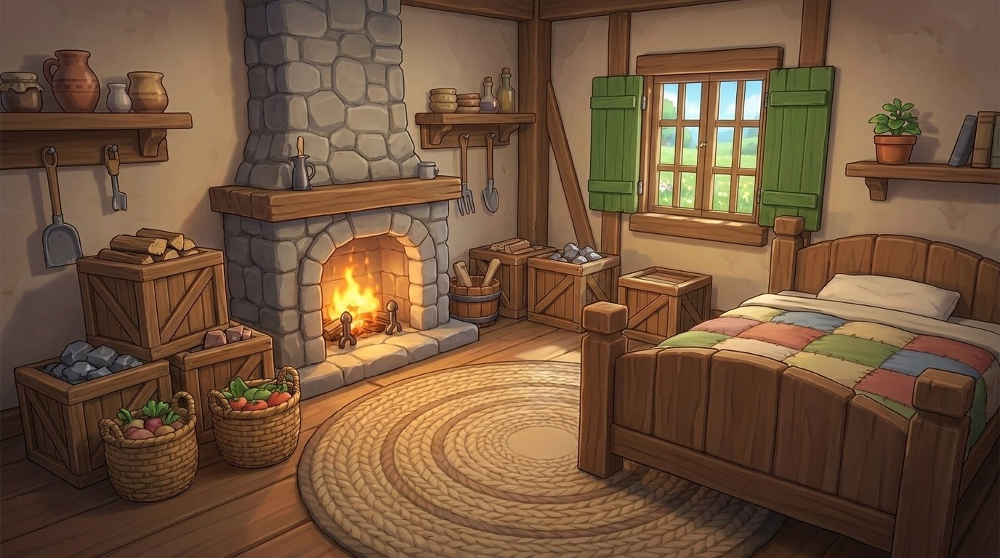

# plank_floor — wooden plank floor tile

**Reference images (look at these first; the text below only supports them):**

Written by Claude from the Canva sheet `canva/17_plank_floor_360.png` (primary reference) and
the source image. Sizes marked *estimate* are Claude's; the proportions are measured on the
sheet.

## What it is
A square, thick, tileable floor section made of five wide wooden planks side by side, nailed
at both ends. Stylised chunky game-art wood.

## Shape
- **Tile** 2.0 m × 2.0 m *(estimate; anchor for scale)*; thickness ≈ 0.07 × the width.
- **Planks**: 5 planks of equal width running the full length, separated by clear V-grooves;
  each plank's top edges are rounded and slightly worn; plank tops very slightly uneven.
- **Nails**: two small dark nail heads near each end of every plank.
- **Sides**: the plank ends show end grain; the tile edges are bevelled.

## Colours and materials (kit)
Warm light-to-mid brown wood (#a86e3e) with visible grain, a little lighter toward the
middle of each plank → `wood_planks` or `wood_timber` tinted; nails → `iron` tinted dark.
Tileable: the tile's outer size must be exactly the anchor size so tiles line up edge to edge.

## Budget
Large piece: ≤ 40 000 triangles.
