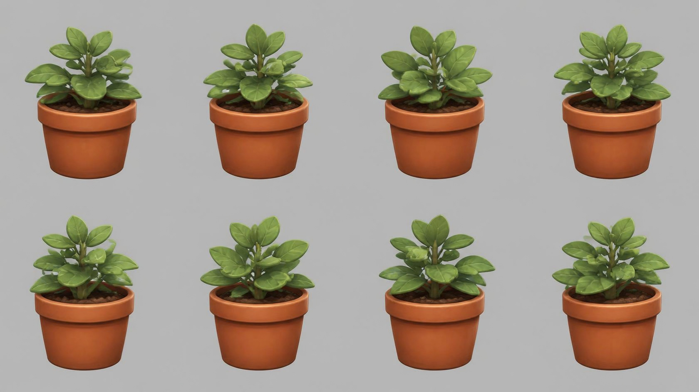

# potted_plant — leafy plant in a terracotta pot

**Reference images (look at these first; the text below only supports them):**

Written by Claude from the Canva sheet `canva/12_potted_plant_360.png` (primary reference) and
the source image. Sizes marked *estimate* are Claude's; the proportions are measured on the
sheet.

## What it is
A small bushy green plant with rounded leaves in a classic terracotta flower pot. Stylised,
soft, slightly glossy leaves.

## Shape
- **Total height** 0.35 m *(estimate; anchor for scale)*; the pot is ≈ 50 % of it.
- **Pot**: tapered (top diameter ≈ 1.1 × pot height, bottom ≈ 0.75 × top), with a thick rolled
  rim band at the top (≈ 18 % of the pot height, standing slightly proud); smooth matte
  terracotta (#c4622f), slightly lighter on the rim.
- **Soil**: dark brown (#4a2e1e), lumpy, a little below the rim.
- **Plant**: one central stem with several side stems; about 25–35 leaves, oval/rounded with
  pointed tips, each with a visible central vein, arranged in pairs up the stems and
  spreading outward and upward; the crown is slightly wider than the pot. Leaf green
  #6f9a3e, lighter #8fb85a on top faces, veins lighter.

## Materials (kit)
Pot → `clay` tinted terracotta; soil → `flat` dark brown (or `rock_dark` tinted brown);
leaves and stems → `flat` greens (leaves as thin, slightly curved double-sided shapes).
Branching could also come from an installed plant add-on (`sapling_tree_gen`) if it helps.

## Budget
Small piece: ≤ 10 000 triangles.
