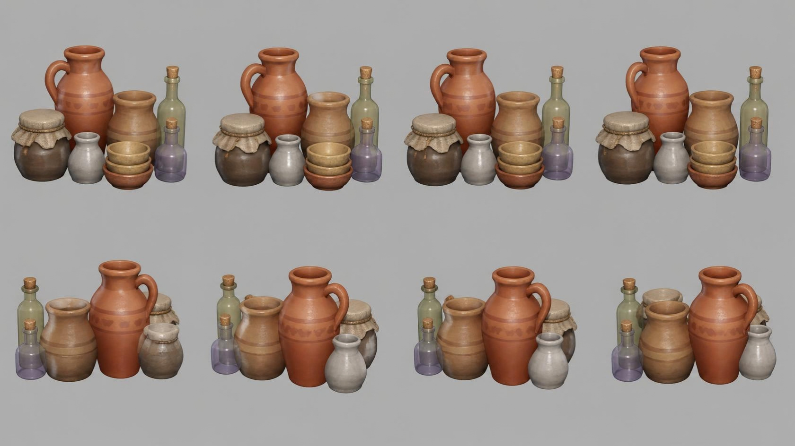

# pottery — group of rustic pottery and bottles

**Reference images (look at these first; the text below only supports them):**

Written by Claude from the Canva sheet `canva/11_pottery_360.png` (primary reference) and the
source image. Sizes marked *estimate* are Claude's; the proportions are measured on the sheet.

**Note on the sheet:** Canva did not rotate this group evenly. The four top-row views are
almost the same front view; the bottom row shows the group from behind. Use the top-left
view as the front (0°) and the bottom row for the back.

## What it is
One prop made of eight pieces standing together as a group (arranged as in the front view).

## Pieces (front view, left to right; heights relative to the tall jug)
- **Tall jug** 0.35 m tall *(estimate; anchor for scale)*, back left-centre: terracotta
  (#c46a42), bulbous body narrowing to a neck with a flared rim, one loop handle on the left,
  two darker painted bands with a small repeating leaf/scallop pattern around the shoulder.
- **Lidded storage jar**, front left, ≈ 0.45 of the jug height: round dark brown-grey glazed
  body (#6a5a4c), its mouth covered by a rough burlap cloth (#cdbb96) tied with twine, the
  cloth hanging in scalloped folds.
- **Small pale vase**, front centre-left, ≈ 0.4: off-white/grey glaze (#c9c6c0), round body,
  short flared neck.
- **Medium jar**, back centre-right, ≈ 0.55: light brown clay (#b98a5e) with two darker bands,
  wide mouth.
- **Stack of three bowls**, front centre-right: shallow bowls, top two tan (#c6a066), bottom
  one terracotta (#c46a42), nested.
- **Tall green glass bottle**, back right, ≈ 0.8: pale olive-green glass (#a9b98c),
  cylindrical body, long neck, cork stopper (#c79a62).
- **Small lilac glass bottle**, front right, ≈ 0.45: lilac/purple glass (#b3a6d6), squat
  flask with neck, cork stopper.

## Materials (kit)
Terracotta and clay → `clay` tinted per piece (low gloss); glazed jar and vase → `clay` or
`flat` with lower roughness; burlap → `linen` tinted sand; twine → `rope`; glass →
`flat(..., alpha=0.5, roughness=0.1)`; cork → `wood_fine` tinted. Build the vessels with
`kit.lathe` (outer profile up, inner wall back down).

## Budget
Medium piece: ≤ 20 000 triangles.
