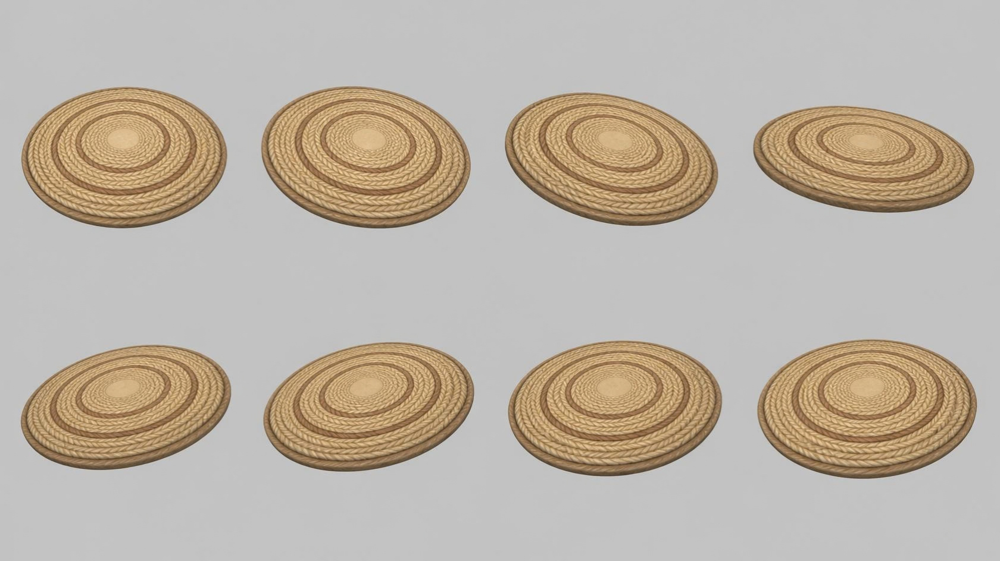

# rug — round braided rug

**Reference images (look at these first; the text below only supports them):**

Written by Claude from the Canva sheet `canva/04_rug_360.png` (primary reference) and the
source image. Sizes marked *estimate* are Claude's; the proportions are measured on the sheet.

## What it is
A large round rug made of one thick braided rope coiled in concentric rings, lying flat on the
floor. Stylised, soft, chunky braid.

## Shape
- **Diameter** 2.2 m *(estimate; anchor for scale)*; thickness ≈ 2.5 % of the diameter
  (a thick, slightly padded rug), with a rounded outer edge.
- **Rings**: from the centre out, a small flat plain disc (≈ 12 % of the diameter, pale sand
  #d9bf8e), then about 6–7 braided rings. Each ring shows a herringbone / plaited braid
  pattern (V-shaped strands).
- **Accent rings**: two of the rings (roughly at 40 % and 75 % of the radius) are a darker,
  reddish tan (#b07a4e); the others are light straw/sand (#d8b884 to #e2c795).
- **Outer rim**: the outermost ring is a slightly darker brown band (#a77a4f) forming a
  bound edge; the rug's side face is visible as a thin brown band.
- The top is not perfectly flat: each ring is a little rounded, so ring boundaries read as
  shallow grooves.

## Materials (kit)
Braid → `rope` (ambientCG via the add-on) tinted per ring; centre disc → `rope` or `linen`
tinted sand; model the rings as rounded tubes (a lathe profile or torus-like rings) so the
grooves are real geometry.

## Budget
Large piece: ≤ 40 000 triangles.
