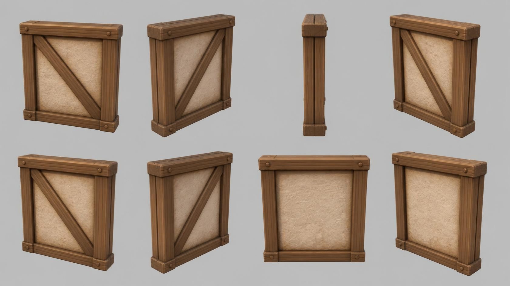

# timber_wall — timber-frame wall section with plaster panel

**Reference images (look at these first; the text below only supports them):**

Written by Claude from the Canva sheet `canva/16_timber_wall_360.png` (primary reference) and
the source image. Sizes marked *estimate* are Claude's; the proportions are measured on the
sheet.

## What it is
A free-standing, tileable wall section: a square frame of heavy timber beams around a cream
plaster panel, with one diagonal brace on the front. Stylised chunky game-art timber.

## Shape (front view, 0°)
- **Section** 2.0 m wide *(estimate; anchor for scale)*; height ≈ 1.05 × width (≈ 2.1 m);
  total depth ≈ 0.12 × width.
- **Frame**: two vertical posts (≈ 12 % of the width wide), a top beam and a bottom sill
  beam; the top beam and sill run the full width and stick out slightly at the ends; each beam
  shows a lengthwise groove as if made of two planks. Round wooden peg heads (dowels) near
  each joint: two on the top beam, one near each bottom corner.
- **Brace**: one diagonal timber across the front of the panel, from the top-left corner to
  the bottom-right corner (front view), set into the frame.
- **Plaster panel**: cream/sand (#d9c39e), rough, softly lumpy surface, recessed slightly
  behind the timbers.
- **Back** (sheet view 180°): the same frame and plaster, with no diagonal brace.

## Colours and materials (kit)
Timber → `wood_timber` tinted medium brown (#8a5a34); plaster → `plaster` tinted sand; peg
heads → `wood_timber` tinted darker.

## Budget
Large piece: ≤ 40 000 triangles.
