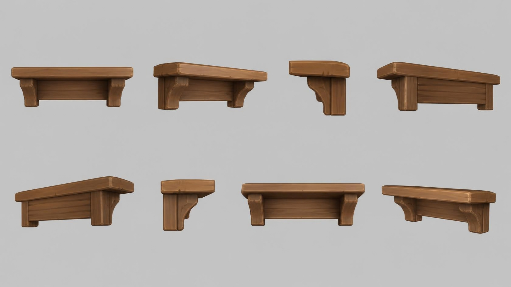

# wall_shelf — wooden wall shelf with brackets

**Reference images (look at these first; the text below only supports them):**

Written by Claude from the Canva sheet `canva/10_wall_shelf_360.png` (primary reference) and
the source image. Sizes marked *estimate* are Claude's; the proportions are measured on the
sheet. Wall-mounted: build with `origin="back"`.

## What it is
An empty wall shelf: a thick plank top on two carved corbel brackets, with a horizontal back
board between the brackets. Stylised chunky game-art wood.

## Shape (front view, 0°)
- **Top plank** length 0.9 m *(estimate; anchor for scale)*; depth ≈ 0.25 × length;
  thickness ≈ 0.045 × length; rounded, slightly worn edges and corners.
- **Brackets**: two corbels under the plank, inset ≈ 8 % of the length from each end; each
  is a thick upright block against the wall with a curved (concave quarter-round) cut on its
  front underside, like a classic corbel; bracket height ≈ 0.14 × length, depth ≈ 0.8 × the
  plank depth.
- **Back board**: a horizontal plank between the two brackets, against the wall, as tall as
  the brackets, with a visible plank seam.
- The back face is flat (it sits against the wall).

## Colours and materials (kit)
Warm mid-brown wood (#94603a), grain visible, lighter worn edges → `wood_timber` tinted.

## Budget
Medium piece: ≤ 20 000 triangles.
