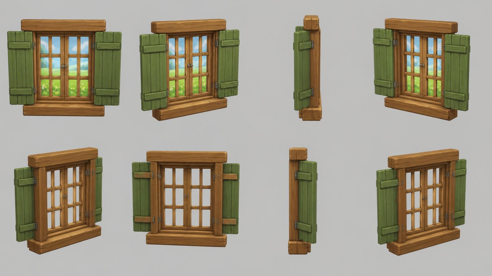

# window — casement window with green shutters

**Reference images (look at these first; the text below only supports them):**

Written by Claude from the Canva sheet `canva/03_window_360.png` (primary reference) and the
source image `source.jpg`. Sizes marked *estimate* are Claude's; the
proportions are measured on the sheet.

## What it is
A wall window unit: a thick wooden frame with a double casement (two sashes, each with small
square panes), a heavy lintel beam above, a deep sill below, and two green plank shutters
opened flat to each side on iron strap hinges. Mounted on a wall: build with `origin="back"`.

## Shape and proportions (front view, 0°)
- **Window frame** (outer, without shutters): width 1.0 m *(estimate; anchor for scale)*;
  height ≈ 1.05 × width.
- **Lintel**: a thick wooden beam across the top, wider than the frame (≈ 1.3 × frame width),
  ≈ 12 % of the frame height tall, deeper than the frame (sticks out at the front).
- **Sill**: a thick wooden beam under the frame, same width as the lintel, a bit taller,
  sticking out further at the front.
- **Frame and sashes**: two casement sashes meeting in the middle, each with a 2 × 3 grid of
  panes separated by square wooden muntins; a small iron latch where the sashes meet.
- **Glass**: clear/see-through (the back views show the grey background through the panes).
  Use thin, lightly tinted transparent glass or leave the panes open.
- **Shutters**: one each side of the frame, opened flat against the wall, each ≈ 0.45 × frame
  width wide and about as tall as the frame; made of 4 vertical planks with two horizontal
  battens (top and bottom) on the front; hung on dark iron strap hinges on the frame side.
- **Depth** (side view 90°): the whole unit is shallow, ≈ 20 % of the frame width, with the
  sill and lintel projecting most.

## Colours and materials (kit)
- Frame, sashes, lintel, sill: warm honey-brown wood (#a86a35) → `wood_timber` tinted.
- Shutters: moss green paint (#6f8f3d) over wood → `wood_planks` tinted green.
- Hinges, latch: dark iron (#3b3632) → `iron` tinted.
- Glass: `flat("glass", "#cfe3ea", roughness=0.05, alpha=0.25)` or no glass.

## Budget
Medium piece: ≤ 20 000 triangles.
